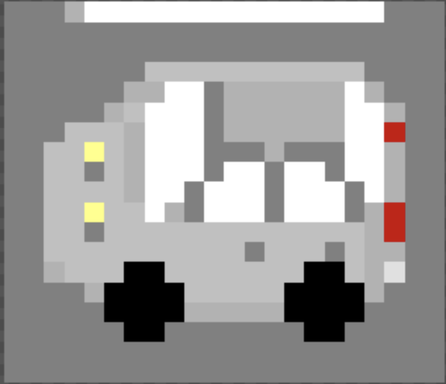

# Functional Specifications | Team 4

Table of Contents

- [Functional Specifications | Team 4](#functional-specifications--team-4)
    - [I. Project Overview](#i-project-overview)
        - [Stakeholders](#stakeholders)
        - [What is Frogger](#what-is-frogger)
        - [How to play](#how-to-play)
    - [II. Game Mechanics](#ii-game-mechanics)
        - [Controls Mechanics](#controls-mechanics)
        - [Map and Cars Mechanics](#map-and-cars-mechanics)
            - [The Road:](#the-road)
            - [Cars Mechanics:](#cars-mechanics)
        - [Life system](#life-system)
        - [Score](#score)
    - [III. Designs/Graphic charter](#iii-designsgraphic-charter)
    - [IV. Use Cases](#iv-use-cases)
    - [V. Requirements and Objectives](#v-requirements-and-objectives)
        - [1. Requirements](#1-requirements)
            - [Frog Display:](#frog-display)
            - [Car Display:](#car-display)
            - [Levels:](#levels)
        - [2. Objectives ](#2-objectives)
            - [Frog Display:](#frog-display-1)
            - [Cars Display:](#cars-display)
            - [Levels:](#levels-1)
    - [VI. Project scope](#vi-project-scope)
    - [VII. Test Plan](#vii-test-plan)
    - [VIII. Success Criteria](#viii-success-criteria)
    - [IX. Legal Stuff](#ix-legal-stuff)
    - [X. Glossary](#x-glossary)

---

## I. Project Overview

The goal of the project is to remake the old retro game "Frogger" using a Go Board [^1] from Nandland.

#### Stakeholders

| Stakeholder                             | Role & Tasks             |
|-----------------------------------------|--------------------------|
|ALGOSUP                                  | Client                   |
|Jason	GROSSO	                          |Project Manager           |
|Mathis	PASCUCCI	                      |Program Manager           |
|Clémentine	CUREL	                      |Technical Lead            |
|Guillaume	DERAMCHI	                  |Software Engineer 1       |
|Victor	LEROY	                          |Software Engineer 2       |
|Emilien	CHINSY	                      |Quality Assurance         |
|Ian	LAURENT	                          |Technical Writer          |

#### What is Frogger

Frogger is a 1981 arcade game, developed by Konami and published by Sega, which was really popular at its time and was said to be "one of the greatest video game ever made"

#### How to play

The goal of the game is to direct five frogs to their homes by dodging traffic on a road.
The frogs start at the buttom of the screen and the player must guide the frog at the top of the screen, across the opposite lanes of traffic without getting killed by cars.

---
## II. Game Mechanics

#### Controls Mechanics
The player controls are four different buttons that are used to navigate the frog, each button causes the frog to hop once in that direction, switch 1 = up, switch 2 = down, switch 3 = left and switch 4 = right. 

On the bottom of the screen the player must guide the frog between opposing lanes of trucks, cars, and other vehicles, to avoid dying.

#### Map and Cars Mechanics 

The map of the Frogger game has a main horizontal sections:

##### The Road:
- The bottom part of the screan serves as the starting area for the player.
- This section of the map represents a busy highway filled with multiple lanes of moving vehicles.
- Vehicles include different types of cars and trucks of varying speeds and sizes. They move horizontally from left to right or right to left across the screen.

##### Cars Mechanics:

#### Life system
The player starts the game with 5 frogs, so five lives. When the frog dies, the player loses one of his five lives and when the lives counter drops to zero the score resets and the game restarts.

#### Score
When the player reaches the top of the screen, his score is updated and a point is added to it. 

The player's goal is to reach the maximum score of 10 points without dying. After reaching the maximum score the game stops and the letters "GG" are displayed on the board.

---

## III. Designs/Graphic charter

---

## IV. Use Cases

#### Use Case N°1: Start Game
- **Description**: The player starts the game.
- **Actor(s)**: Player, Game System
- **Pre-Conditions**: The game is installed and launched.
- **Flow of Events**:
    - Player presses "Start".
    - The game system initializes the level.
    - The frog appears at the starting position at the bottom of the screen.
    - The game system begins movement of obstacles (cars, logs, etc.).
- **Post-Conditions**: The player can control the frog; obstacles are in motion.
- **Exit Criteria**: The game is now playable.

#### Use Case N°2: Navigating through the road
- **Description**: The player interacts with the game environment.
- **Actor(s)**: Player, Game System
- **Pre-Conditions**: The game has started, and the player is controlling the frog.
- **Flow of Events**:
    - The player presses the switch on the GO-Board to move the frog.
    - The game system moves the frog in the indicated direction.
    - The game system checks for collisions between the frog and moving cars/trucks.
- **Post-Conditions**: The frog moves as directed by player inputs.
- **Exit Criteria**: The frog safely crosses the road or collides with an obstacle.
 
#### Use Case N°3: Finishing a Level
- **Description**: Completing the game's objectives.
- **Actor(s)**: Player, Game System
- **Pre-Conditions**: The player successfully navigates the frog across both the road and the river.
- **Flow of Events**:
The frog reaches the top of the screen.
- **Post-Conditions**: The player's score is updated, and the frog's position  is reset to the starting position.
- **Exit Criteria**: The player finishes the level, and the game transitions to the next level.

#### Use Case N°4: Dying
- **Description**: The player's character loses a life.
- **Actor(s)**: Player, Game System
- **Pre-Conditions**: The frog has collided with an obstacle or fallen into water.
- **Flow of Events**:
    - The frog collides with an obstacle.
    - The game system detects the collision.
    - The frog dies, and the game system deducts a life from the player's remaining lives.
    - The frog respawns at the starting position.
- **Post-Conditions**: The frog loses a life, and the player either respawns or the game ends.
- **Exit Criteria**: The level resets, or the game ends if no lives remain.

#### Use Case N°5: Win the Game
- **Description**: The player successfully reaches a score of 10.
- **Actor(s)**: Player, Game System
- **Pre-Conditions**: The player has reached the last level.
- **Flow of Events**:
    - The player guides the frog to the end in the last level.
    - The game system displays the letters "GG" on the Go-Board.
- **Post-Conditions**: The player wins the game and sees a victory screen.
- **Exit Criteria**: The game resets to the initial state.

#### Use Case N°6: Game Over
- **Description**: Ending the game after losing all lives.
- **Actor(s)**: Player, Game System
- **Pre-Conditions**: The player has no remaining lives.
- **Flow of Events**:
    - The game system checks the player's remaining lives.
    - When the last life is lost, the game transitions to a "Game Over" screen.
    - The game displays the final score and a prompt to restart or quit the game.
- **Post-Conditions**: The game ends, and the player sees the final score and game over message.
- **Exit Criteria**: The game resets to the initial state.

---
## V. Requirements and Objectives 

#### 1. Requirements

- ##### Frog Display: 
The frog shall be drawn as a 1x1 grid on the VGA display (where each grid is 32x32 pixels). The frog shall be white in color. 

- ##### Car Display: 
There shall be at least 1 car on the screen at a time. The car shall be drawn as a 1x1 grid. The car shall be white in color. 

- ##### Levels: 
There shall be at least 1 level in the game, when the Frog reaches the top of the screen the game is complete. 

#### 2. Objectives 

- ##### Frog Display: 
The frog shall be drawn as a Sprite that looks like a real frog. The Sprite shall have colors. 

- ##### Cars Display: 
There shall be up to 16 cars on the screen at a time. The cars shall have the ability to move at different speeds.

- ##### Levels: 
There shall be at least 10 levels in the game, when the level increases the game difficulty gets harder (for example, cars speed increase, number of cars increase).

---

## VI. Project scope

*Brouillon*

| Must have | Should have | Could have | 
| :---: | :---: | :---: |
| Frog, Cars, Buttons, Display on Monitor | Levels | Sprites, Lives | Levels After 99 |

| In Scope | Out of Scope |
|---|---|
|Delivering a clone of Frogger in Verilog[^2]|Having Levels After 99|
|Go Board must be used to control the frog and display the score
|The game must have at least a win and a lose condition
|The game must use a VGA display

---

## VII. Test Plan
Anything relative to this project's tests can be found in [this document](./TestPlan.md).

---

## VIII. Success Criteria
- The game display every element without any kind of stuttering
- The player can control the character without latency between the player action and game's reaction using the Go Board
- The player can progress amongst levels the same way as the original game
- The game does not return errors on launch
- The game does not crashes
- The player can loose and win if conditions are met.

---

## IX. Legal

données utilisateur 
Dans le cadre d'un projet scolaire visant à recréer Frogger sur une board FPGA, tu pourrais être en mesure de le faire en respectant certaines règles :
Recréer le concept sans copier les assets originaux : Tu peux recréer le gameplay de Frogger (déplacement d'un personnage à travers des obstacles), mais il est préférable de concevoir tes propres graphismes, sons, et animations plutôt que d'utiliser ceux du jeu original.
Code source : Si tu codes le jeu toi-même en utilisant le FPGA, cela pourrait être considéré comme une nouvelle implémentation inspirée de Frogger, ce qui est généralement permis dans le cadre d'un projet éducatif.
Respect des droits : Évite de reproduire des noms, logos, ou autres éléments qui sont directement protégés par des droits d'auteur ou de marque. Appeler ton jeu par un autre nom et utiliser des designs originaux serait une bonne approche.
Documentation du projet : Dans ton rapport ou présentation, explique que le projet est une réinterprétation d’un concept classique et cite les inspirations, mais souligne que tout le code et les éléments graphiques ont été créés par toi.
---

## X. Glossary
[^1]: Go-Board: FPGA Development Board For Beginners.
[^2]: Verilog: A hardware description language (HDL) used to model electronic systems.

