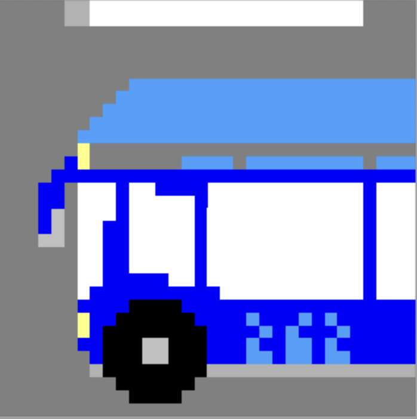
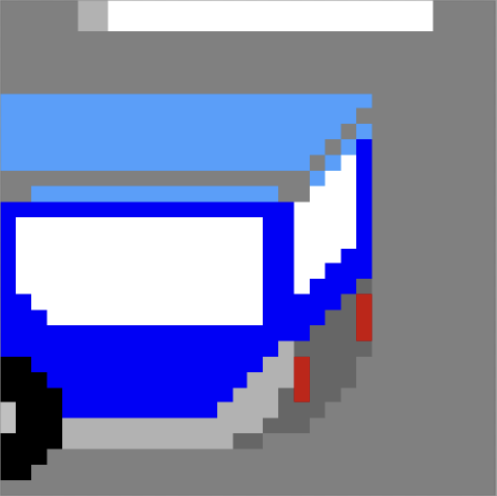
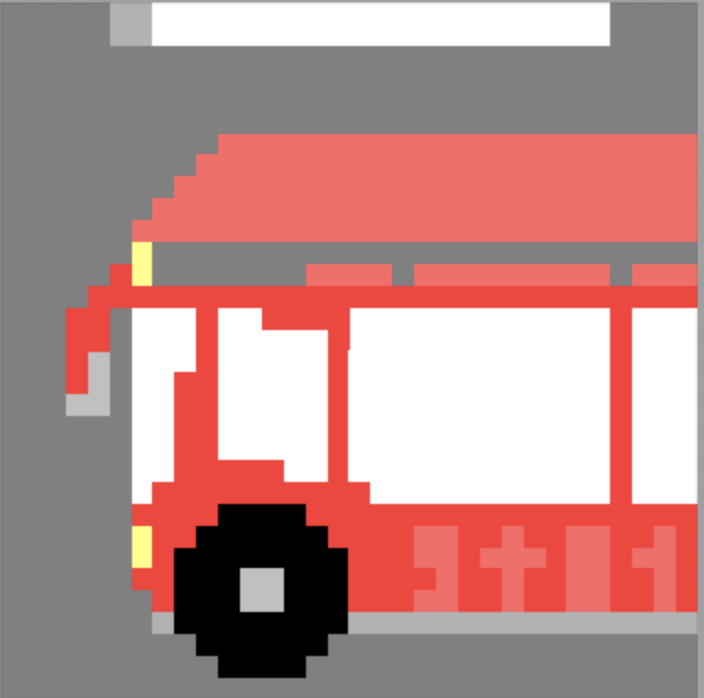
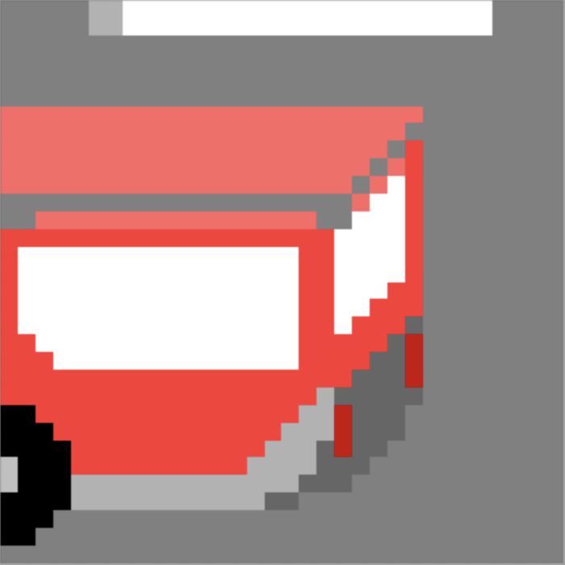

# Functional Specifications | Team 4

Table of Contents

- [Functional Specifications | Team 4](#functional-specifications--team-4)
    - [I. Project Overview](#i-project-overview)
        - [Stakeholders](#stakeholders)
        - [What is Frogger](#what-is-frogger)
        - [How to play](#how-to-play)
        - [Project scope](#project-scope)
    - [II. Game Mechanics](#ii-game-mechanics)
        - [Controls](#controls)
        - [Map and Vehicles Mechanics](#map-and-vehicles-mechanics)
            - [The Map](#the-map)
            - [Vehicles Mechanics](#vehicles-mechanics)
        - [Scoring System](#scoring-system)
    - [III. Designs/Graphic charter](#iii-designsgraphic-charter)
        - [Car Designs](#car-designs)
        - [Bus Designs](#bus-designs)
        - [Truck Designs](#truck-designs)
        - [Frog Designs](#frog-designs)
    - [IV. Use Cases](#iv-use-cases)
        - [Use Case N°1: Start Game](#use-case-n1-start-game)
        - [Use Case N°2: Navigating through the road](#use-case-n2-navigating-through-the-road)
        - [Use Case N°3: Finishing a Level](#use-case-n3-finishing-a-level)
        - [Use Case N°4: Win the Game](#use-case-n4-win-the-game)
        - [Use Case N°5: Game Over](#use-case-n5-game-over)
    - [V. Requirements and Objectives](#v-requirements-and-objectives)
        - [1. Requirements](#1-requirements)
            - [Frog Display Requirements](#frog-display-requirements)
            - [Car Display Requirements](#car-display-requirements)
            - [Levels Requirements](#levels-requirements)
        - [2. Objectives](#2-objectives)
            - [Frog Display Objectives](#frog-display-objectives)
            - [Car Display Objectives](#car-display-objectives)
            - [Levels Objectives](#levels-objectives)
    - [VI. Test Plan](#vi-test-plan)
    - [VII. Success Criteria](#vii-success-criteria)
    - [VIII. Difficulty Evolution Breakdown](#viii-difficulty-evolution-breakdown)
    - [IX. Legal](#ix-legal)
    - [X. Glossary](#x-glossary)

---

## I. Project Overview

The goal of the project is to remake the retro game "Frogger" using a Go Board[^1] from Nandland.

#### Stakeholders

| Stakeholders                             | Role             |
|-----------------------------------------|--------------------------|
|ALGOSUP                                  | Client                   |
|Jason	GROSSO	                          |Project Manager           |
|Mathis	PASCUCCI	                      |Program Manager           |
|Clémentine	CUREL	                      |Technical Lead            |
|Guillaume	DERAMCHI	                  |Software Engineer 1       |
|Victor	LEROY	                          |Software Engineer 2       |
|Emilien	CHINSY	                      |Quality Assurance         |
|Ian	LAURENT	                          |Technical Writer          |

#### What is Frogger

Frogger is an arcade game, developed by Konami and published in 1981 by Sega, which was really popular when it was released and was said to be "one of the greatest video game ever made".

#### How to Play

The goal of the game is to direct a frog to it's home by dodging traffic on a road.
The frog starts at the bottom of the screen and the player must guide the frog to the top of the screen, without getting killed by cars.

#### Project Scope

| In Scope | Out of Scope |
|---|---|
|Delivering a working game inspired by Frogger using the Go Board|Additional levels beyond level 8|
|Implementing game logic in Verilog[^2] to run on the Go Board and display on a VGA monitor|Multiplayer system|
|Win and lose conditions|Sound effects or music|
|Go Board must be used to control the frog and display the score|Advanced graphics|

---
## II. Game Mechanics

#### Controls
The player controls the frog using the four different buttons on the board, each button causes the frog to hop once in that direction, switch 1 = up, switch 2 = down, switch 3 = left and switch 4 = right. 

Starting at the bottom of the screen, the player must guide the frog between opposing lanes of trucks, cars, buses, and avoid dying.

#### Map and Vehicles Mechanics 

##### The Map:
- The bottom part of the screen serves as the starting area for the player.
- The center of the map represents a busy highway filled with multiple lanes of moving vehicles.
- Vehicles include different types of cars and trucks of varying speeds and sizes. They move horizontally from left to right or right to left across the screen.

##### Vehicles Mechanics:
- Vehicles move horizontally across the screen, either from left to right or right to left.
- Each vehicle has a spawnrate[^3] and set speed, which can vary depending on the level or difficulty.
- The vehicles continuously respawn to maintain the flow of traffic. 
- Each vehicle has a defined hitbox that matches its size on the grid.
- Vehicles types:
    - Cars : They can be either slow or fast (2 - 3 boxes per second) and take up 1 grid space.
    - Buses : They are slow (1 boxes per second), taking up 2 grid spaces.
    - Trucks : They are fast (2 boxes per second), taking up 3 grid spaces.

#### Scoring System
When the player reaches the top of the screen, his score is updated and a point is added to it. 

The player's goal is to reach the maximum score of 8 points without dying. After reaching the maximum score the game stops and the letters "GG" are displayed on the board.

---

## III. Designs/Graphic charter

#### Car Designs:

---

#### Bus Designs:

---

---

---

#### Truck Designs:

---

#### Frog Designs:

---

## IV. Use Cases

#### Use Case N°1: Start Game
- **Description**: The player starts the game.
- **Actor(s)**: Player, Game System
- **Pre-Conditions**: The game is installed and launched.
- **Flow of Events**:
    - Player presses "Start".
    - The game system initializes the level.
    - The frog appears at the starting position at the bottom of the screen.
    - The game system begins movement of obstacles (cars, logs, etc.).
- **Post-Conditions**: The player can control the frog; obstacles are in motion.
- **Exit Criteria**: The game is now playable.

#### Use Case N°2: Navigate through the road
- **Description**: The player interacts with the game environment.
- **Actor(s)**: Player, Game System
- **Pre-Conditions**: The game has started, and the player is controlling the frog.
- **Flow of Events**:
    - The player presses a switch on the GO-Board to move the frog.
    - The game system moves the frog in the indicated direction.
    - The game system checks for collisions between the frog and moving cars/trucks.
- **Post-Conditions**: The frog moves as directed by player input.
- **Exit Criteria**: The frog safely crosses the road or collides with an obstacle.
 
#### Use Case N°3: Finish a Level
- **Description**: Completing the game's objective.
- **Actor(s)**: Player, Game System
- **Pre-Conditions**: The player successfully navigates the frog across the road.
- **Flow of Events**:
The frog reaches the top of the screen.
- **Post-Conditions**: The player's score is updated, and the frog's position  is reset to the starting position.
- **Exit Criteria**: The player finishes the level, and the game transitions to the next level.

#### Use Case N°4: Win the Game
- **Description**: The player successfully reaches a score of 8.
- **Actor(s)**: Player, Game System
- **Pre-Conditions**: The player has reached the last level.
- **Flow of Events**:
    - The player guides the frog to the end in the last level.
    - The game system displays the letters "GG" on the Go-Board.
- **Post-Conditions**: The player wins the game and sees a victory screen.
- **Exit Criteria**: The game resets to it's initial state.

#### Use Case N°5: Game Over
- **Description**: Ending the game after dying.
- **Actor(s)**: Player, Game System
- **Pre-Conditions**: The player collides with a car, or all four buttons are pressed at the same time on the go-board.
- **Flow of Events**:
    - The game system detects the collision.
    - When the frog dies, the game displays the final score on the Go-Board.
- **Post-Conditions**: The game ends, game over message, final score on the board.
- **Exit Criteria**: The game resets to it's initial state.

---
## V. Requirements and Objectives 

#### 1. Requirements

- ##### Frog Display Requirements 
The frog shall be drawn as a 1x1 cell on the VGA display (where each grid is 32x32 pixels). The frog shall be green in color. 

- ##### Car Display Requirements
There shall be at least 1 car on the screen at a time. The car shall be drawn as a 1x1 cell. The car shall be red in color. 

- ##### Level Requirements
There shall be at least 1 level in the game, when the Frog reaches the top of the screen the game is complete. 

#### 2. Objectives 

- ##### Frog Display Objectives
The frog shall be drawn as a Sprite[^4] that looks like a real frog. The Sprite shall have colors. 

- ##### Car Display Objectives
There shall be up to 16 cars on the screen at a time. The cars shall have the ability to move at different speeds.

- ##### Level Objectives
There shall be at least 8 levels in the game, when the level increases the game difficulty gets harder (for example, cars speed increase, number of cars increase).

---

## VI. Test Plan
Anything relative to this project's tests can be found in [this document](./TestPlan.md).

---

## VII. Success Criteria

These are our succes criteria:

- The game displays every element without any kind of stuttering.
- The player can control the character without latency between the player's action and game's reaction.
- The player can progress amongst levels the same way as the original game.
- The game does not return errors on launch.
- The game does not crash.
- The player can lose and win if conditions are met.

---

## VIII. Difficulty Curve Breakdown

| Level Number | Number of Vehicle per Level |
|:---|:---:|
|1| 6 |
|2| 6 |
|3| 6 |
|4| 6 |
|5| 7 |
|6| 7 |
|7| 12 |
|8| 12 | 

#### Vehicle Types per Level

| **Type of Vehicle** | **Level 1** | **Level 2** | **Level 3** | **Level 4** | **Level 5** | **Level 6** | **Level 7** | **Level 8** |
|:-------------------:|:-----------:|:-----------:|:-----------:|:-----------:|:-----------:|:-----------:|:-----------:|:-----------:|
| **Car**| ✔️ | ❌ | ❌ | ✔️ | ✔️ | ✔️ | ✔️ | ✔️ | 
| **Bus**| ❌ | ✔️ | ❌ | ✔️ | ✔️ | ❌ | ✔️ | ✔️ |
| **Truck**| ❌ | ❌ | ✔️ | ❌ | ❌ | ✔️ | ✔️ | ✔️ |

you can find the detailled layout of the levels [HERE](https://docs.google.com/spreadsheets/d/192H_l_FA7qSmk4Z7lmOYOKX7erZ45zHxe5udNauicEI/edit?usp=sharing)

---

## IX. Legal

In this project, we are remaking the Frogger game on a Go Board (FPGA[^5]) for educational purposes. As this is a school project, we are not using any of the original game’s assets, names, or code to avoid legal issues. All graphics, sounds, and game logics are original or designed by the team. Here are the key guidelines:

 - Intellectual Property: We are not copying any original Frogger assets or elements. Instead, we’re creating our own designs, including the frog, cars, and environment.
 - Gameplay Inspiration: While the gameplay mechanics are inspired by Frogger, the implementation and design are our own. This ensures that we remain within fair use for educational purposes.
 - Trademark Avoidance: The name “Frogger” will not be used in the final version of the project. The game will be renamed, and no trademarks from the original game are to be included.
 - Educational Exemption: This project is non-commercial and solely for educational purposes, which provides some leeway under copyright laws.

---

## X. Glossary

[^1]: Go-Board: An FPGA development board aimed for beginners, often used for educational projects.

[^2]: Verilog: A hardware description language (HDL) used to model and design digital systems such as integrated circuits.

[^3]: Spawnrate: Refers to the frequency at which new entities (such as characters, items, enemies, or obstacles) appear in a game or simulation.

[^4]: Sprite: A 2D image or animation integrated into a larger scene, often used for characters and objects in video games.

[^5]: FPGA (Field-Programmable Gate Array): An integrated circuit designed to be configured by the customer after manufacturing. It can be programmed to perform specific tasks using hardware description languages like Verilog.
