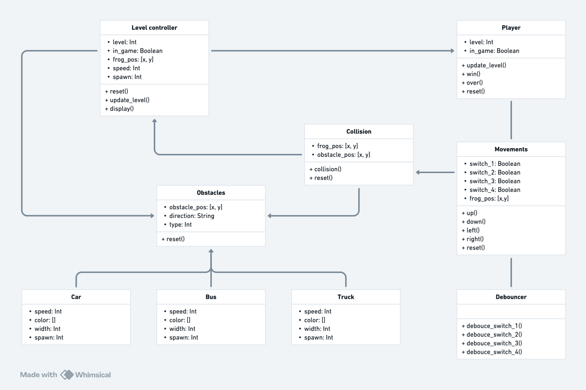
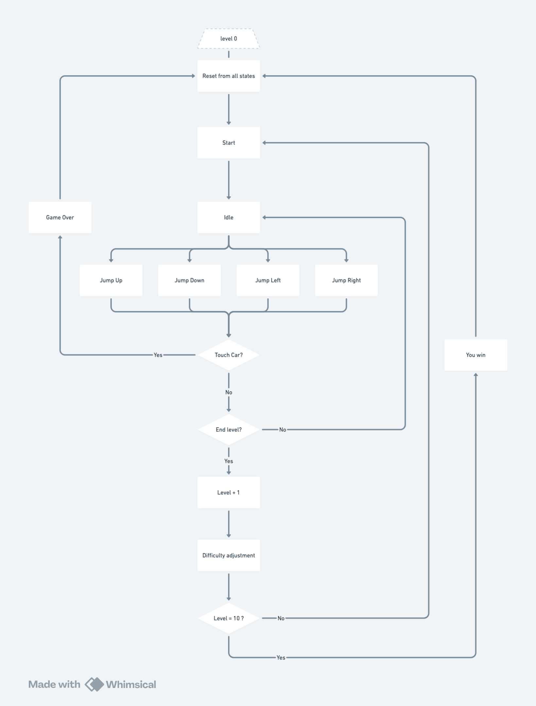

# Technical Specifications - Frogger Project

 Table of contents 

- [Technical Specifications - Frogger Project](#technical-specifications---frogger-project)
  - [1. Introduction](#1-introduction)
  - [2. System Architecture](#2-system-architecture)
  - [3. Modules and Components](#3-modules-and-components)
    - [3.1 VGA Controller](#31-vga-controller)
    - [3.2 Frog Movement Logic](#32-frog-movement-logic)
    - [3.3 Vehicle Movement Logic](#33-vehicle-movement-logic)
    - [3.4 Collision Detection](#34-collision-detection)
    - [3.5 Level Management](#35-level-management)
    - [3.6 Reset Mechanism](#36-reset-mechanism)
  - [4. Sprite and Graphics Management](#4-sprite-and-graphics-management)
  - [5. Timing and Control](#5-timing-and-control)
  - [6. Collision Detection](#6-collision-detection)
  - [7. Game Mechanisms](#7-game-mechanisms)
  - [8. Memory and Storage](#8-memory-and-storage)
  - [9. Input/Output Management](#9-inputoutput-management)
  - [10. Constraints and Limitations](#10-constraints-and-limitations)
  - [11. Testing and Validation](#11-testing-and-validation)
  - [12. Development Stages](#12-development-stages)
  - [Future Plans:](#future-plans)
  - [Power Consumption Considerations:](#power-consumption-considerations)
- [Sources](#sources)
- [Footnotes](#footnotes)

## 1. Introduction
- **Project overview**: Develop a video game based on Frogger for the Go Board FPGA development board. The game involves guiding a frog from the bottom to the top of a VGA[^5] screen while avoiding cars. The player uses four buttons to control the frog’s movement (up, down, left, and right).
- **Target platform**: Go Board FPGA, with VGA output to an external monitor.
- **Key components**: Frog movement, obstacles, level[^13] progression, and a 7-segment[^10] display for level indication.

For further context, see the [Functional Specifications](./FunctionalSpecifications.md).

## 2. System Architecture

The Go Board FPGA acts as the central processing unit, managing game logic, inputs, and outputs.

- **Go Board FPGA**: Central processing, handling VGA output, button inputs, and game logic.
- **Input**: 
    - 4 directional buttons (up, down, left, right) for frog movement.
    - Reset[^12] functionality via simultaneous press of all 4 buttons.
- **Output**: 
    - VGA display (640x480) for game visuals.
    - 7-segment display for level indication.

See the [system architecture diagram of the Go Board](./Images/Go_Board_V1.pdf)[^11] for more details.

## 3. Modules and Components

While the game logic uses a 20x15 grid[^6] for movement calculations, the grid itself may not be displayed to the player in the final version, focusing instead on showing only the frog and vehicle sprites[^8].

### 3.1 VGA Controller
- **Description**: Handles the VGA display, operating at a resolution of 640x480, with 512 color combinations.
- **Grid layout**: Uses a 20x15 grid of cells, where each cell is 32x32 pixels.
- **Sprite memory**: Stores frog and vehicle sprites in Block RAM[^1].
- **Input**: Receives sprite data from Block RAM and control signals for rendering.
- **Output**: Generates VGA signals to render the frog and vehicles on the screen.

### 3.2 Frog Movement Logic
- **Description**: Controls frog movement based on button presses, allowing the frog to navigate the grid.
- **Grid-based movement**: The frog moves one grid space at a time. It initially appears at the bottom center of the grid (X: 11, Y: 15) at the start of each level.
- **Debouncing**: Implements debouncing[^4] to ensure that button presses are registered only once per press.
- **Boundaries**: The frog cannot move outside the 20x15 grid.
- **Input**: Receives debounced button press signals for movement.
- **Output**: Updates the frog's position in grid coordinates and sends control signals to the VGA controller to render the new position.

### 3.3 Vehicle Movement Logic
- **Description**: Manages the movement of various vehicles across the screen.
- **Vehicle directions**: The direction of movement is determined based on the row:
    - **Row 2**: Left to right.
    - **Rows 3-5**: Right to left.
    - **Rows 6-8**: Left to right.
    - **Rows 9-11**: Right to left.
    - **Rows 12-14**: Left to right.
    - **To be updated**
- **Vehicle sizes**:
    - **Car**: Occupies a 1x1 grid cell.
    - **Bus**: Occupies 2x1 grid cells.
    - **Truck**: Occupies 3x1 grid cells.
- **Movement patterns**: Vehicle movements follow predetermined patterns rather than random generation. For more details, refer to the [Functional Specifications](./FunctionalSpecifications.md).
- **Input**: Takes in the current level and speed settings.
- **Output**: Updates the positions of the vehicles on the grid and sends rendering information to the VGA controller.

### 3.4 Collision Detection
- **Description**: Checks for collisions[^7] between the frog and vehicles, or detects when the frog reaches the top row.
- **Collision with vehicles**: If the frog's position matches a vehicle's grid position, the level is reset.
- **Top row detection**: If the frog reaches the top row, the level is incremented, and difficulty is increased.
- **Input**: Receives the frog's position and the positions of obstacles (vehicles).
- **Output**: Sends collision event signals to trigger level resets or progressions.

### 3.5 Level Management
- **Description**: Manages the game's level progression and associated difficulty adjustments.
- **Level display**: Shows the current level using a 2-digit 7-segment display.
- **Level completion**: When the frog reaches the top row, it resets to the bottom, the level increments, and the game's difficulty increases.
- **Level reset**: Resets the game to level 1 in the event of a collision or a manual reset.
- **Input**: Receives signals indicating level completion or reset events.
- **Output**: Updates the 7-segment display and adjusts game settings for the new level.

### 3.6 Reset Mechanism
- **Description**: Provides a mechanism for resetting the game state.
- **Global reset**: Pressing all four directional buttons simultaneously triggers a global reset, setting the game back to the starting level, resetting the frog's position, and clearing the screen.
- **Safety checks**: Implements debouncing logic to prevent accidental resets. This ensures that only deliberate simultaneous presses of all four buttons activate the reset.
- **Input**: Detects button presses to initiate the reset.
- **Output**: Resets game state variables, including level, frog position, and vehicle positions.

## 4. Sprite and Graphics Management

- **Memory optimization**: To optimize memory usage, sprite data is stored in compressed formats where applicable, minimizing the use of Block RAM. Only necessary frames are loaded into Block RAM during active gameplay to prevent overuse of resources.

- **Future enhancements**:
    - Animated sprites will be implemented by cycling through preloaded frames of animation for both the frog (hopping) and the vehicles (moving wheels). These frames will be controlled using additional Flip-Flops and LUTs[^3] to manage timing and transitions.

Verilog code

    module block_ram(
        input clk,
        input [9:0] address, // 10-bit address
        input [3:0] data_in, // 4-bit data for sprite colors
        input we,            // Write enable signal
        output reg [3:0] data_out // 4-bit data out (color)
    );

        reg [3:0] memory [0:1023]; // 1K Block RAM for sprite storage

        always @(posedge clk) begin
            if (we) begin
                memory[address] <= data_in; // Write to memory
            end else begin
                data_out <= memory[address]; // Read from memory
            end
        end
    endmodule

## 5. Timing and Control
- **Game clock**[^9]: Uses flip-flops[^2] to manage game timing, such as car movement speed and button debounce timing.
- **Game loop management**: The game operates on a central clock signal, ensuring synchronization of all elements such as frog movements, vehicle updates, and VGA screen refreshes. The loop processes inputs, updates game state, and refreshes the display at 60Hz.

Debouncing is set to 10 milliseconds to ensure clean signal detection. The game clock operates at a frequency of 60 Hz to synchronize with the VGA display refresh rate.

## 6. Collision Detection
- **Car-Frog collision**: Detects when the frog's grid position overlaps with a car’s grid position.
- **Top-Frog collision**: Detects when the frog reaches the top row.

| **Frog_X** | **Frog_Y** | **Obstacle_X** | **Obstacle_Y** | **Collision Detected?** |
| ---------- | ---------- | -------------- | -------------- | ----------------------- |
| X          | Y          | X              | Y              | Yes                     |
| X          | Y          | X - 1          | Y              | No                      |
| X          | Y          | X              | Y + 1          | No                      |
| X          | Y          | X + 1          | Y + 1          | No                      |

## 7. Game Mechanisms
- **Level scaling**: Increment the number of cars and their speed with each new level.
- **Speed increase**: Adjust car speed based on the current level.

**Speed table** - **To be updated**

| Levels | **Car speed** | **Bus speed** | **Truck speed** |
| ------ | ------------- | ------------- | --------------- |
| 1      | 2 cell/s      | None          | None            |
| 2      | None          | None          | None            |
| 3      | 3 cells/s     | 1 cell/s      | None            |
| 4      | 3 cells/s     | 1 cell/s      | None            |
| 5      | 3 cells/s     | 2 cells/s     | 2 cell/s        |
| 6      | 3 cells/s     | 2 cells/s     | 2 cell/s        |
| 7      | 3 cells/s     | 2 cells/s     | 2 cell/s        |
| 8      | 4 cells/s     | 2 cells/s     | 3 cell/s        |
| 9      | 4 cells/s     | 3 cells/s     | 3 cells/s       |
| 10     | 4 cells/s     | 3 cells/s     | 3 cells/s       |

**Spacing table** - **To be updated**

|Spacing|1|2|3|4|5|6|7|8|9|10|
|-------|-|-|-|-|-|-|-|-|-|--|
|Car    |5|-|-|2|5|5|5|5|2-5|3-5|
|Bus    |-|4|-|4|4|-|3|3|12|3-4|
|Truck  |-|-|3|-|-|3|3|3|-|3-5|

For more details about the spacing, the [design of the levels is available here](https://docs.google.com/spreadsheets/d/192H_l_FA7qSmk4Z7lmOYOKX7erZ45zHxe5udNauicEI/edit?gid=0#gid=0). It will show you the levels on grid.

## 8. Memory and Storage
- **FPGA resource utilization**:
  - Block RAM usage estimated at 70% for sprite storage.
  - LUTs and Flip-Flops estimated to use 40-60% of logic resources.
- **Memory optimization techniques**: To optimize memory usage, sprite data is stored in compressed formats when possible, and selective loading techniques are employed to minimize Block RAM usage.

## 9. Input/Output Management
- **Buttons**: Directional buttons map to frog movement with debouncing.
    - **Pin mapping**: Up (SW1), Down (SW2), Left (SW3), Right (SW4).

## 10. Constraints and Limitations
- **Grid size**: 20x15 grid, 32x32 pixels per cell.
- **Color limitations**: VGA supports 512 colors.

## 11. Testing and Validation
- **Simulation**: Use FPGA simulation tools for isolated module testing.
- **On-board testing**: Test gameplay functionality across various levels.
- **Debugging tools**: Use onboard LEDs for state indication and UART output for detailed debug logs.

For a detailed testing plan, refer to the [Test Plan](./TestPlan.md).

## 12. Development Stages
1. Implement basic PONG game for initial FPGA and VGA testing.
2. Draw the white frog on the screen as a 1x1 grid.
3. Enable basic frog movement (up button).
4. Increment levels upon reaching the top.
5. Add car and collision logic.
6. Implement car movement across the screen.
7. Introduce dynamic levels, increased difficulty, and multiple cars.

## Future Plans:
- **Audio integration**: Add simple sound effects, such as a sound when the frog hops, vehicle collisions, and level completions.

- **Vehicle movement patterns**: While the vehicle movements follow predetermined patterns, adding some random variation in the spawn timing or vehicle speed could increase the challenge.

- **Enhanced collision feedback**: Incorporate visual or auditory feedback when collisions occur to enhance player experience. Simple visual effects (like flashing sprites) could be a good start.

- **Dynamic difficulty adjustment**: Beyond simple speed increases, consider adding new obstacles or changing the layout dynamically as levels progress to keep the gameplay engaging.

## Power Consumption Considerations:
- Optimize power consumption by reducing clock signal frequency during idle periods.

# Sources
1. [The Go Board - FPGA Development](https://nandland.com/the-go-board/)  
   - A resource for learning about the Go Board FPGA development board, including specifications, tutorials, and project ideas.

2. [Getting Started with FPGA](https://nandland.com/book-getting-started-with-fpga/)  
   - A guide that covers the basics of FPGA programming, including VHDL/Verilog languages, and hardware design principles.

3. [Hardware Sprites in FPGA](https://projectf.io/posts/hardware-sprites/)  
   - Discusses implementing hardware-based sprites on FPGAs, including memory management techniques for sprite rendering.

4. [FPGA Architecture Reference Manual](./Images/Go_Board_V1.pdf)
   - A detailed reference for FPGA architecture, covering different FPGA components, including Block RAM, LUTs, and Flip-Flops. (This might be a physical or digital manual depending on the FPGA you're using.)

# Footnotes

[^1]: Block RAM (BRAM): A dedicated memory block within FPGAs used to store large data, such as sprites for video games.
[^2]: Flip-Flops (FF): Digital circuits used in FPGAs for storing binary data.
[^3]: Look-Up Tables (LUTs): Perform boolean functions within FPGAs.
[^4]: Debouncing: Ensures clean signal generation for button presses.
[^5]: VGA Controller: Manages visual data output to a VGA display.
[^6]: Grid-based Movement: Movement based on a fixed grid structure.
[^7]: Collision Detection: Determines if two game objects occupy the same grid space.
[^8]: Sprite: A 2D image used for game characters or objects.
[^9]: Game Clock: Manages timing for game events.
[^10]: 7-Segment Display: Displays decimal numerals using seven segments.
[^11]: System Architecture: The structured framework defining system components.
[^12]: Reset Mechanism: Clears the game state and returns to initial conditions.
[^13]: Level Management: Tracks player progression through game levels.
[^14]: VGA Palette (3-bit Color): Supports a 512-color palette with 3-bit depth per color channel.
